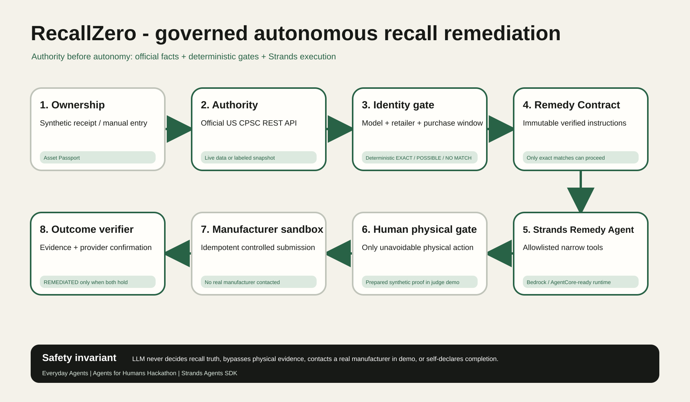

# RecallZero

> Other products tell you what was recalled. RecallZero gets it out of your life.

RecallZero is a governed autonomous product-safety agent built for the **Agents for Humans Hackathon** and entered in the **Everyday Agents** track. It knows what a household owns, watches the official US Consumer Product Safety Commission recall database, deterministically verifies whether an exact unit is affected, and advances the governed remedy workflow until the outcome is independently verified.

## Why this is different

Recall trackers stop at `RECALL FOUND`. RecallZero starts there:

`ownership -> official safety event -> exact identity gate -> Remedy Contract -> governed action -> human only for physical work -> outcome verification -> REMEDIATED`

The product deliberately has no chat-first home screen. Its primary metric is **unresolved recalled products**, and the desired state is zero.

## Working judge demo

The included path uses:

- a clearly labeled synthetic receipt for a Wantefully XR-8801 hair dryer;
- the live official CPSC REST API, with a visibly labeled official snapshot fallback;
- a deterministic four-predicate identity match;
- a genuine Strands Agents SDK runtime implementation;
- a controlled manufacturer sandbox - no claim is sent to a real manufacturer;
- one prepared synthetic physical-action evidence handoff;
- provider confirmation plus evidence as non-bypassable completion predicates.

The live CPSC query window is generated from the current UTC date so the judge path does not age out after the build date.

## Safety architecture

The model may interpret an already verified remedy, sequence allowlisted tools, and explain progress. It may not invent or confirm a recall, override official instructions, contact a real manufacturer in the public demo, bypass missing evidence, or mark its own work complete.



Architecture source: [`recallzero-architecture.mmd`](docs/architecture/recallzero-architecture.mmd).
High-resolution exports for judges:
- [Architecture PNG (1800x1050)](docs/architecture/recallzero-architecture.png)
- [Architecture PDF](docs/architecture/recallzero-architecture.pdf)

## Strands and AWS

`services/agent/` contains the Python Strands runtime. It uses:

- `strands.Agent` with narrow remedy tools;
- `strands.models.BedrockModel` for the Amazon Bedrock target;
- `BedrockAgentCoreApp` as the AgentCore-compatible runtime entrypoint;
- deterministic policy code that can be exercised without AWS credentials;
- an explicit `RECALLZERO_DETERMINISTIC_DEMO=1` mode that never pretends cloud execution occurred;
- verifiable runtime trace evidence: [`docs/evidence/strands-runtime-verification.md`](docs/evidence/strands-runtime-verification.md) (with raw trace at [`docs/evidence/strands-agent-execution-trace.json`](docs/evidence/strands-agent-execution-trace.json)).

AgentCore deployment is a production target and is **not claimed as deployed** unless a real AWS invocation has been verified.

## Run locally

Prerequisites: Node.js 22+, Python 3.11+, and `uv`.

```powershell
npm ci
uv sync --project services/agent
npm run dev
```

Open `http://localhost:3000`. No login or cloud credential is required for the controlled public demo.

Run the governed AgentCore-compatible service locally in deterministic demo mode:

```powershell
$env:RECALLZERO_DETERMINISTIC_DEMO = "1"
uv run --project services/agent python services/agent/main.py
```

For Bedrock/AgentCore execution, follow [`services/agent/README.md`](services/agent/README.md). Do not treat the deterministic adapter as proof of a deployed AgentCore runtime.

## Verification

```powershell
npm run lint
npm run typecheck
npm test
npm run test:agent
npm run build
npm run test:e2e
npm run check:secrets
```

GitHub Actions runs three independent verification jobs: frontend quality/build, Python agent safety tests, and repeated Playwright desktop/mobile journeys. Browser runs save visual evidence into the workflow artifact on every CI execution.

The tests cover exact/possible/no-match separation, CPSC authority restrictions, the dynamic official-query window, legal state transitions, physical-evidence and provider completion gates, idempotency, deterministic stress cases, the complete browser journey, responsive rendering, and browser console errors.

## Demo truth boundaries

| Surface | Demo truth |
|---|---|
| Recall authority | Live CPSC REST API or explicitly labeled official snapshot |
| Product / receipt | Synthetic demo fixture |
| Matching | Deterministic code |
| Agent runtime | Real Strands code; public web demo uses a labeled deterministic protocol mirror unless AgentCore is configured |
| Remedy provider | RecallZero-owned sandbox |
| Physical evidence | Prepared synthetic demo evidence |
| Real manufacturer contact | Never performed |

## Repository map

- `app/`, `components/`: Next.js product surface and server routes.
- `lib/domain/`: safety kernel, matching, contracts, workflow invariants.
- `lib/server/`: official CPSC client.
- `services/agent/`: Strands tools, Bedrock model adapter, and AgentCore entrypoint.
- `tests/`, `e2e/`, `services/agent/tests/`: unit, policy, stress, and browser evidence.
- `docs/architecture/`: architecture source and presentation-ready vector export.
- `docs/demo/`: exact five-minute recording script.
- `docs/submission/`: Devpost copy and Builder.aws article draft.
- `docs/hackathon-build/`: scope, PRD, spec, checklist, and build journal.

## Hackathon submission status

A real Devpost draft has been created for RecallZero. Final submission still requires user-owned identity/media inputs that cannot be invented: the AWS Builder ID, the public YouTube/Vimeo demo URL, submitter/country answers, and the architecture file upload.

## License

[MIT](LICENSE) © 2026 Vivek Yarra.
